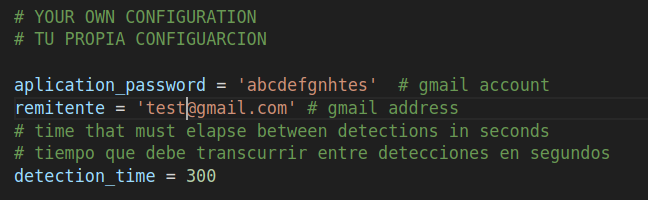

# ipcamera
Ip camera deteccion with Yolo
Convierte tu camara IP en inteligente con detección de imágenes usando YOLO8.

Solo necesitas saber la dirección IP de tu cámara.
Puedes seleccionar 3 tipos de detecciones y su % de precisión basado en modelo COCO.
Guarda log de detecciones.
Permite enviar un email con la imagen capturada.

Turn your IP camera into smart ones with image detection using YOLO8.

You just need to know the IP address of your camera.
You can select 3 types of detections and their % accuracy based on COCO model.
Save log of detections.
Allows you to send an email with the captured image.

Imagen de la app. Image of the app.

Configuración propia. Own configuration.

Ejemplo de email. Email example.

Ejemplo de log.Log example.

Modelo yolo.Yolo model.

